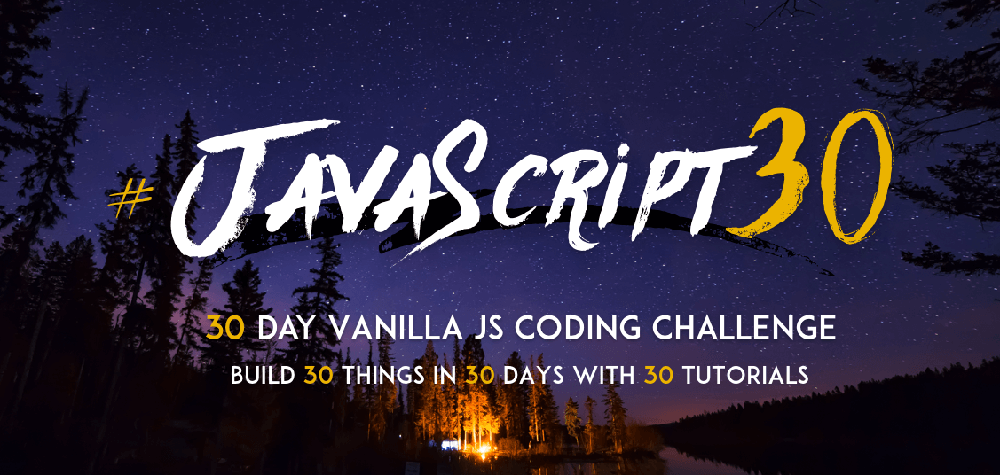

# 30-Day-Vanilla-JS-Coding-Challenge

This repo contains all the tasks that were created over the Wes Boss's course [JavaScript30](https://javascript30.com/).

## The list of tasks:

1. 09-02-2021 Day#1  JavaScript Drum Kit  [x]
2. 10-02-2021 Day#2  JS and CSS Clock  [x]
3. 11-02-2021 Day#3  CSS Variables  [x]
4. 12-02-2021 Day#4  Array Cardio Day 1  [x]
5. 13-02-2021 Day#5  Flex Panel Gallery  [x]
6. 14-02-2021 Day#6  Type Ahead  [x]